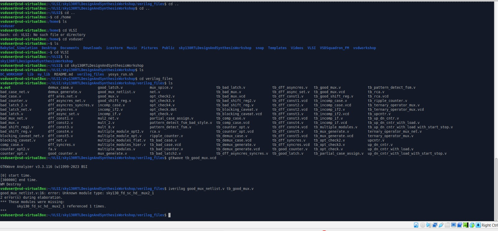
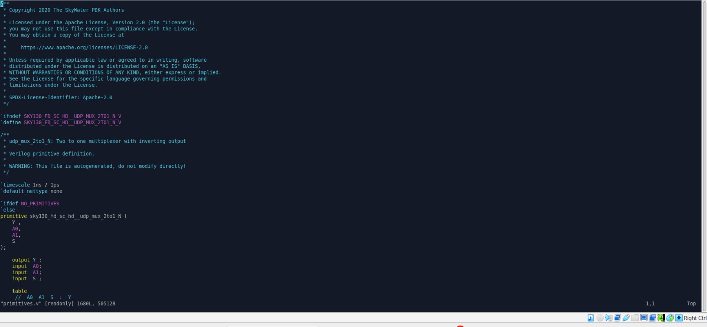
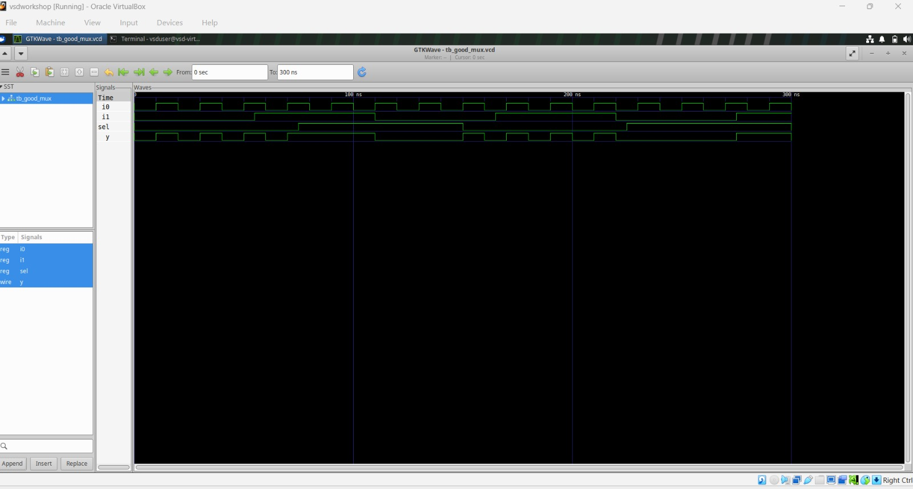
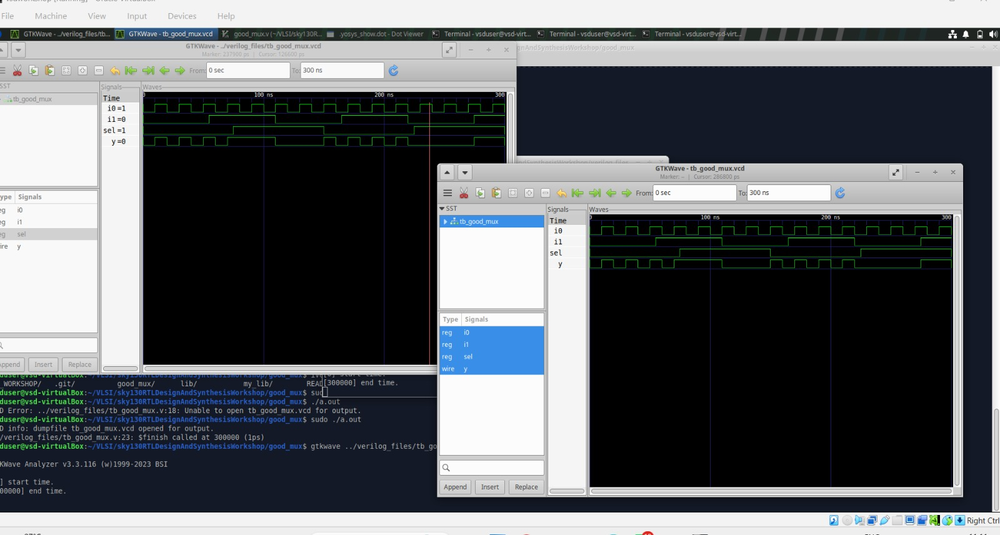
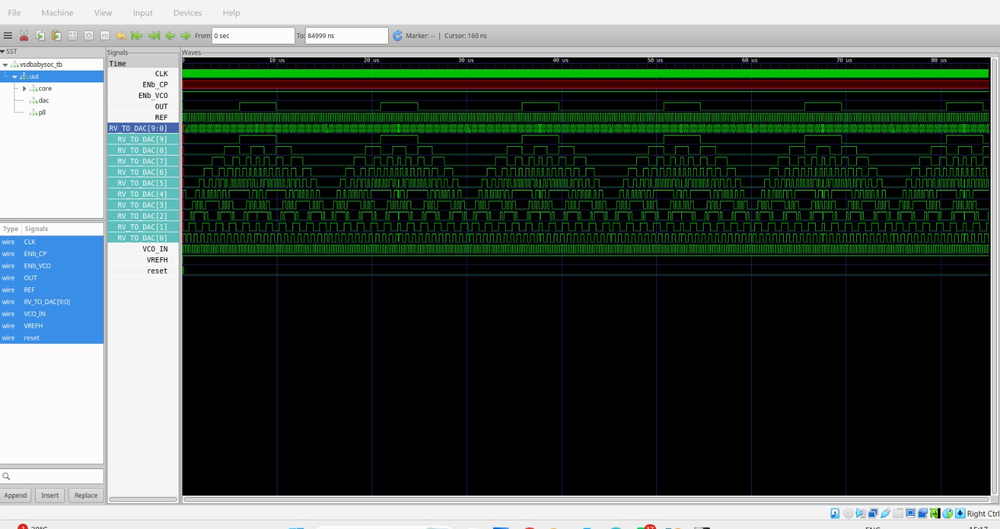
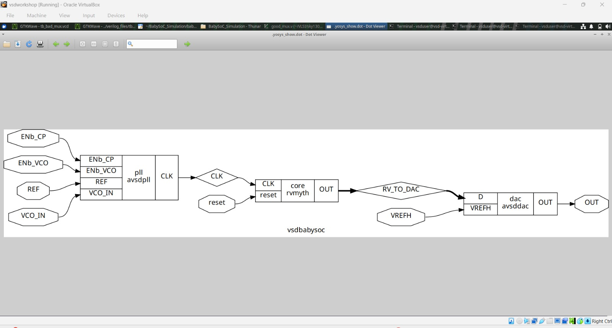

# VLSI Design and Synthesis Lab Work

## Repository Structure

```text
lab work RLC_GLS_DAC/
│
├── README.md
│
└── screenshots/
    ├── BabySoC Synthesis Statistics.jpeg
    ├── Baby_soc synthesized design.jpeg
    ├── Baby_Soc_simulation _soc2_netlist.jpeg
    ├── Baby_Soc_simulation _soc_netlist.jpeg
    ├── checking the gate.jpeg
    ├── Comparion post_pre.jpeg
    ├── comparison of goodmux & badmux.jpeg
    ├── Design hierarchy.jpeg
    ├── File_structures.jpeg
    ├── final Practical Flow.jpeg
    ├── GLS pre_synth.jpeg
    ├── Good_mux technology mapped .jpeg
    ├── Good_mux.jpeg
    ├── good_mux_simulation.jpeg
    ├── Lekeage power information.jpeg
    ├── mux_code.jpeg
    ├── post_synthesis.jpeg
    ├── rv_myth.jpeg
    ├── test_bench file.jpeg
    └── vsdbaby_soc.jpeg
```

All laboratory screenshots are kept inside the `screenshots/` folder so that the repository remains organized and the README can use clean relative paths.

---

# About This Repository

This repository contains the VLSI Design and Synthesis laboratory work completed during the workshop. The work covers RTL design, Verilog coding, functional simulation, waveform analysis, Yosys synthesis, technology mapping, gate-level simulation, hierarchical design, standard-cell library analysis, and the VSD BabySoC synthesis and verification flow.

The laboratory work was carried out using:

- Verilog HDL
- GVim / VI
- Icarus Verilog
- GTKWave
- Yosys
- SKY130 Standard-Cell Library
- Linux Terminal
- VSD BabySoC Environment

---

# Complete VLSI Design Flow

The overall flow followed during the laboratory work was:

```text
RTL Design
    ↓
Verilog Coding
    ↓
Testbench
    ↓
RTL / Functional Simulation
    ↓
Icarus Verilog
    ↓
VCD Generation
    ↓
GTKWave
    ↓
Yosys Synthesis
    ↓
Logic Optimization
    ↓
Technology Mapping
    ↓
Gate-Level Netlist
    ↓
Gate-Level Simulation
    ↓
GTKWave Verification
```

### Practical Flow


---

# Tools Used

| Tool | Purpose |
| --- | --- |
| GVim / VI | Verilog source-code creation and editing |
| Verilog HDL | RTL hardware description |
| Icarus Verilog | RTL and gate-level simulation |
| GTKWave | Waveform visualization |
| Yosys | RTL synthesis and optimization |
| SKY130 Library | Standard-cell technology mapping |
| Linux Terminal | Command-line design flow |
| VSD BabySoC | SoC-level synthesis and verification |

---

# RTL Design, Simulation and Synthesis

## 1. VLSI Design Flow

The laboratory began with understanding the complete RTL-to-gate-level design flow, including design entry, simulation, synthesis, optimization, technology mapping, and gate-level verification.


---

## 2. Project File Structure

The project file structure was examined to understand the organization of the laboratory files and design resources.



---

## 3. Design Hierarchy

Hierarchical RTL design was studied to understand how a larger hardware design can be constructed using multiple interconnected modules.

```text
Top Module
    ↓
Sub-Module(s)
    ↓
Intermediate Signals
    ↓
Output
```


---

# MUX Design, Simulation and Synthesis

## 4. MUX RTL Code

A multiplexer was implemented using Verilog HDL. The RTL source code was examined before simulation and synthesis.



---

## 5. Good MUX Functional Simulation

The Good MUX was simulated to verify its functional behavior. The simulation waveform was observed using GTKWave.



---

## 6. Good MUX Synthesis

The Good MUX RTL was synthesized using Yosys. The synthesized circuit was inspected to understand the hardware generated from the RTL description.



---

## 7. Good MUX Technology Mapping

After synthesis, the Good MUX was technology mapped using the SKY130 standard-cell library.


---

## 8. Good MUX Post-Synthesis Simulation

The synthesized MUX implementation was used for post-synthesis verification. The resulting waveform was examined to verify the synthesized design behavior.



---

## 9. Good MUX vs Bad MUX

Good and Bad MUX implementations were compared to understand the effect of RTL coding style on simulation and synthesized hardware behavior.


---

# Gate-Level Simulation

## 10. Gate-Level Simulation Flow

The general gate-level simulation flow followed during the laboratory was:

```text
RTL
 ↓
Synthesis
 ↓
Technology Mapping
 ↓
Gate-Level Netlist
 ↓
Standard-Cell Models
 ↓
Testbench
 ↓
Icarus Verilog
 ↓
VCD
 ↓
GTKWave
```


---

## 11. Checking the Synthesized Gate

The synthesized gate-level implementation was inspected as part of the verification process.


---

# Standard-Cell Library Analysis

## 12. Leakage Power Information

Leakage-power information available from the standard-cell library was studied as part of understanding library-based cell characteristics.


---

# VSD BabySoC

## 13. VSD BabySoC

The VSD BabySoC environment was studied to apply the RTL-to-synthesis flow to a larger practical System-on-Chip design.



---

## 14. RVMYTH Module

The RVMYTH module within the BabySoC design was inspected as part of understanding the SoC hierarchy and RTL implementation.


---

## 15. BabySoC Testbench

The BabySoC testbench was examined for simulation and verification of the SoC design.


---

## 16. BabySoC Synthesized Design

The BabySoC design was synthesized using Yosys. The synthesized hardware representation was inspected to understand the resulting design structure.


---

## 17. BabySoC Synthesis Statistics

Yosys synthesis statistics were examined to understand the resulting hardware and synthesized design components.


---

## 18. BabySoC Netlist

The generated BabySoC gate-level netlist was inspected as part of the synthesis flow.


### Additional BabySoC Netlist View


---

## 19. BabySoC Simulation

The BabySoC simulation environment was examined using the RTL, testbench, simulation tools, and waveform viewer.

```text
BabySoC RTL
     ↓
Testbench
     ↓
Icarus Verilog
     ↓
Simulation
     ↓
VCD
     ↓
GTKWave
```

---

## 20. Pre-Synthesis and Post-Synthesis Comparison

The pre-synthesis and post-synthesis results were compared to understand the relationship between the original RTL implementation and its synthesized gate-level implementation.


---

# Practical VLSI Flow Summary

The complete practical flow covered during the laboratory work can be summarized as:

```text
Verilog RTL
     ↓
GVim / VI
     ↓
Testbench
     ↓
Icarus Verilog
     ↓
Functional Simulation
     ↓
GTKWave
     ↓
Yosys
     ↓
RTL Synthesis
     ↓
Logic Optimization
     ↓
Technology Mapping
     ↓
SKY130 Standard Cells
     ↓
Gate-Level Netlist
     ↓
Gate-Level Simulation
     ↓
GTKWave Verification
     ↓
VSD BabySoC
     ↓
Pre-Synthesis Simulation
     ↓
Synthesis
     ↓
Post-Synthesis Simulation
     ↓
Pre/Post-Synthesis Comparison
```


---

# Key Concepts Covered

The laboratory work provided practical exposure to:

- RTL design using Verilog HDL
- Testbench development
- Functional / RTL simulation
- VCD generation
- GTKWave waveform analysis
- Yosys-based RTL synthesis
- Logic optimization
- Technology mapping
- SKY130 standard-cell libraries
- Gate-level netlists
- Gate-level simulation
- Hierarchical RTL design
- MUX implementation
- Good MUX and Bad MUX comparison
- Standard-cell leakage-power information
- VSD BabySoC hierarchy
- RVMYTH module inspection
- BabySoC testbench analysis
- BabySoC synthesis
- BabySoC netlist inspection
- Synthesis statistics
- Pre-synthesis and post-synthesis comparison

---

# Important Yosys Commands

```bash
yosys
```

```bash
read_verilog <file.v>
```

```bash
read_liberty -lib <library.lib>
```

```bash
synth -top <top_module>
```

```bash
dfflibmap -liberty <library.lib>
```

```bash
abc -liberty <library.lib>
```

```bash
opt
```

```bash
show
```

```bash
flatten
```

```bash
setundef -zero
```

```bash
clean -purge
```

```bash
rename -enumerate
```

```bash
stat
```

```bash
write_verilog -noattr <netlist.v>
```

---

# Conclusion

The VLSI Design and Synthesis laboratory provided practical exposure to the RTL-to-gate-level design and verification flow.

The work covered Verilog RTL coding, testbench-based simulation, GTKWave waveform analysis, Yosys synthesis, logic optimization, technology mapping, SKY130 standard-cell usage, gate-level netlist inspection, and gate-level verification.

The MUX experiments demonstrated the relationship between RTL coding and synthesized hardware, while the Good MUX and Bad MUX comparison highlighted the importance of correct RTL implementation.

The laboratory was further extended to hierarchical design and the VSD BabySoC environment, including RVMYTH inspection, testbench analysis, synthesis, synthesis statistics, netlist inspection, and pre-synthesis/post-synthesis comparison.

Overall, the practical work demonstrated the progression:

```text
RTL DESIGN
    ↓
FUNCTIONAL SIMULATION
    ↓
GTKWAVE
    ↓
YOSYS SYNTHESIS
    ↓
OPTIMIZATION
    ↓
TECHNOLOGY MAPPING
    ↓
GATE-LEVEL NETLIST
    ↓
GLS
    ↓
WAVEFORM VERIFICATION
    ↓
VSD BABYSOC
    ↓
PRE-SYNTHESIS SIMULATION
    ↓
POST-SYNTHESIS SIMULATION
    ↓
DESIGN VERIFICATION
```

---

## Author

**Name:** MD Sohail Ahmed  
**Department:** Electronics and Communication Engineering (ECE)  
**Institution:** Anurag University
