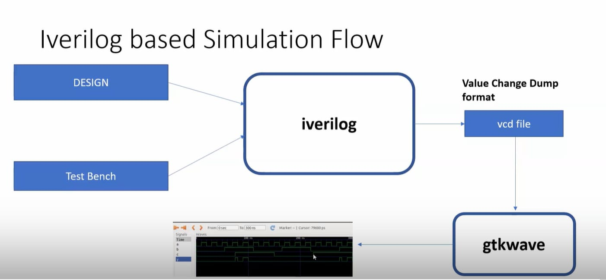
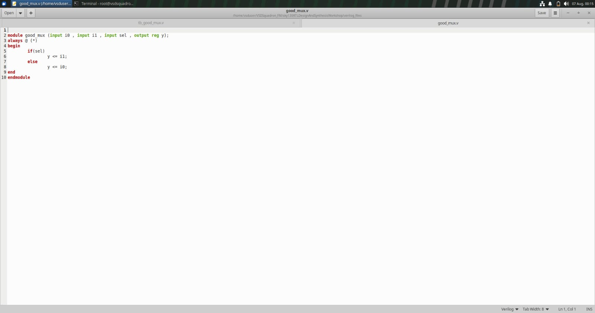

# Module 1 – Introduction to Verilog RTL Design and Synthesis

## Table of Contents

- [Overview](#overview)
- [1. RTL Design Flow](#1-rtl-design-flow)
- [2. Design and Testbench](#2-design-and-testbench)
- [3. 2:1 Multiplexer — Specification](#3-21-multiplexer--specification)
- [4. Verilog RTL Code](#4-verilog-rtl-code)
- [5. Simulation with Icarus Verilog](#5-simulation-with-icarus-verilog)
- [6. Waveform Analysis with GTKWave](#6-waveform-analysis-with-gtkwave)
- [7. Introduction to Yosys](#7-introduction-to-yosys)
- [8. Standard-Cell Libraries](#8-standard-cell-libraries)
- [9. Simulation vs. Synthesis](#9-simulation-vs-synthesis)
- [Key Takeaways](#key-takeaways)

## Overview

This module covers the baseline RTL flow used throughout the rest of the workshop: write a Verilog design, write a testbench for it, simulate with Icarus Verilog, inspect the waveform in GTKWave, then get a first look at RTL-to-gate-level synthesis with Yosys. The design used throughout is a 2:1 multiplexer.

## 1. RTL Design Flow

```
Verilog RTL Design → Testbench → Icarus Verilog → Simulation → VCD File → GTKWave → Waveform Analysis → Yosys → Synthesis
```



## 2. Design and Testbench

The **design** is the RTL code describing the required hardware; the **testbench** drives inputs into the design and lets you observe the outputs — it is not synthesized, it exists purely to verify functionality.

| Design | Testbench |
|---|---|
|  |  |

## 3. 2:1 Multiplexer — Specification

| Signal | Direction | Purpose |
|---|---|---|
| `i0` | input | Selected when `sel = 0` |
| `i1` | input | Selected when `sel = 1` |
| `sel` | input | Select line |
| `y` | output | Multiplexer output |

| `sel` | `y` |
|---|---|
| 0 | `i0` |
| 1 | `i1` |

## 4. Verilog RTL Code

```verilog
module good_mux (input i0 , input i1 , input sel , output reg y);
always @ (*)
begin
	if(sel)
		y <= i1;
	else
		y <= i0;
end
endmodule
```



## 5. Simulation with Icarus Verilog

```bash
iverilog good_mux.v tb_good_mux.v
./a.out
gtkwave tb_good_mux.vcd
```

`iverilog` compiles the design and testbench into a simulation executable; running it produces a `.vcd` (Value Change Dump) file with every signal transition.


## 6. Waveform Analysis with GTKWave

`y` tracks `i1` when `sel` is high and `i0` when `sel` is low across the simulated window — confirming the mux behaves correctly at the RTL level, before any synthesis is involved.


## 7. Introduction to Yosys

Yosys is the synthesis tool used to convert the behavioral RTL description into a gate-level representation.

```
Verilog RTL → Read Design → Process RTL → Optimize → Synthesize → Netlist
```

```bash
read_verilog good_mux.v
hierarchy -top good_mux
```


## 8. Standard-Cell Libraries

A `.lib` (Liberty) file is the set of standard cells (AND/OR/NOT/NAND/NOR gates, flip-flops, muxes, etc.) a synthesis tool is allowed to map RTL onto, along with each cell's timing/power characteristics.

```
RTL Design → RTL Synthesis → Logic Representation → Technology Mapping → Standard Cell Library → Gate-Level Netlist
```


## 9. Simulation vs. Synthesis

| | Simulation | Synthesis |
|---|---|---|
| Checks | Functional correctness | Convertibility to real hardware logic |
| Inputs | RTL + testbench | RTL (+ library, for tech mapping) |
| Output | Waveform | Netlist |
| Tool | Icarus Verilog | Yosys |
| Analysis | GTKWave | Library / technology mapping |

---

## Key Takeaways

- The RTL flow has two independent checkpoints: **simulation** (does the logic behave correctly?) and **synthesis** (can it be built from real cells?) — passing one doesn't guarantee the other, which is exactly what Module 4's GLS work verifies.
- A testbench is verification-only scaffolding — it drives the DUT and observes it, but is never itself synthesized.
- A `.lib` file isn't optional metadata; synthesis can't produce a netlist without knowing what cells it's allowed to use.
