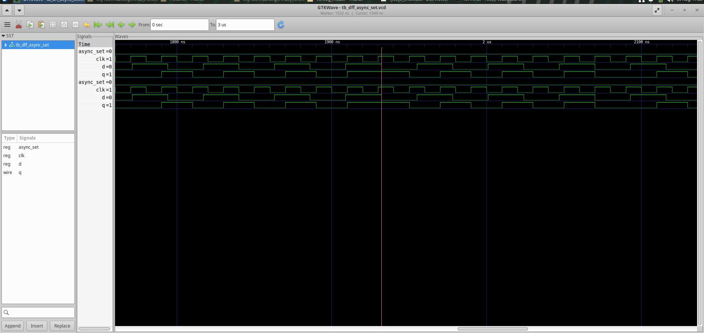
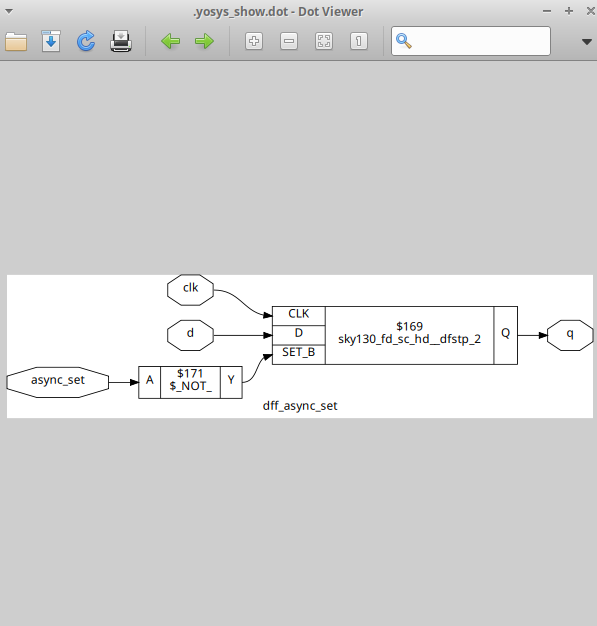
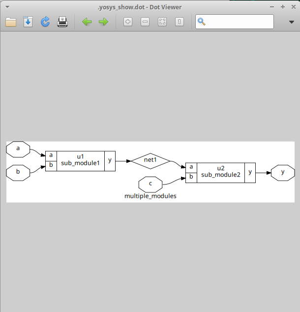

# Module 2 – Sequential Logic, Hierarchical Design, and RTL Synthesis

## Table of Contents

- [Overview](#overview)
- [1. D Flip-Flop Designs](#1-d-flip-flop-designs)
  - [dff_syncres — Synchronous Reset](#dff_syncres--synchronous-reset)
  - [dff_async_set — Asynchronous Set](#dff_async_set--asynchronous-set)
  - [dff_asyncres — Asynchronous Reset](#dff_asyncres--asynchronous-reset)
- [2. RTL Simulation](#2-rtl-simulation)
- [3. RTL Synthesis Using Yosys](#3-rtl-synthesis-using-yosys)
- [4. Multiplier Designs](#4-multiplier-designs)
  - [mul2 — Multiply by 2](#mul2--multiply-by-2)
  - [mult8 — Multiply by 8](#mult8--multiply-by-8)
- [5. Hierarchical Design](#5-hierarchical-design)
- [6. Hierarchical Synthesis](#6-hierarchical-synthesis)
- [7. Flat Synthesis](#7-flat-synthesis)
- [8. Hierarchical vs. Flat Netlist](#8-hierarchical-vs-flat-netlist)
- [Key Takeaways](#key-takeaways)

## Overview

This module moves from combinational logic (Module 1) into **sequential** RTL — three flip-flop reset/set styles — then into two synthesis-organization concepts: how Yosys handles **multiplication by a constant power of 2**, and the difference between **hierarchical** and **flattened** synthesis output on a multi-module design. All synthesis in this module targets the SKY130 standard-cell library.

## 1. D Flip-Flop Designs

Three flip-flop variants, differing only in how (and whether) they can be forced to a known state outside of normal clocked operation.

### dff_syncres — Synchronous Reset

A synchronous reset only takes effect at the active clock edge — it's just another input to the same clocked always block.

```verilog
module dff_syncres (
    input clk,
    input async_reset,
    input sync_reset,
    input d,
    output reg q
);

always @(posedge clk)
begin
    if (sync_reset)
        q <= 1'b0;
    else
        q <= d;
end
endmodule
```

### dff_async_set — Asynchronous Set

An asynchronous set forces `q` to 1 immediately, independent of the clock — it's in the sensitivity list alongside `clk`.

```verilog
module dff_async_set (
    input clk,
    input async_set,
    input d,
    output reg q
);

always @(posedge clk, posedge async_set)
begin
    if (async_set)
        q <= 1'b1;
    else
        q <= d;
end
endmodule
```

| Waveform | Synthesized Diagram |
|---|---|
|  |  |

The synthesized diagram shows something the RTL doesn't: the SKY130 flop cell used here (`sky130_fd_sc_hd__dfstp_2`) has an **active-low** `SET_B` pin, not an active-high set. Since the RTL's `async_set` is active-high, Yosys inserts a `$_NOT_` gate between the input and the cell's `SET_B` pin to convert polarity. The RTL never asks for an inverter — it falls out of matching the behavior to what the library cell actually provides.

### dff_asyncres — Asynchronous Reset

Same idea as the async set, but forcing `q` to 0 instead of 1.

```verilog
module dff_asyncres (
    input clk,
    input async_reset,
    input d,
    output reg q
);

always @(posedge clk, posedge async_reset)
begin
    if (async_reset)
        q <= 1'b0;
    else
        q <= d;
end
endmodule
```

| Waveform | Synthesized Diagram |
|---|---|
| *(missing — see note below)* |  |

Same pattern as `dff_async_set`: the mapped cell (`sky130_fd_sc_hd__dfrtp_1`) takes an active-low `RESET_B`, so Yosys inserts a `sky130_fd_sc_hd__clkinv_1` inverter ahead of it to flip the RTL's active-high `async_reset`.

> **Missing image:** no `dff_asyncres`-specific waveform has been added yet. The two files uploaded as candidate reset waveforms were both the *same* `tb_dff_async_set.vcd` screenshot (async-set testbench, not async-reset) — so rather than mislabel a set waveform as the reset one, this slot is left empty. Run `gtkwave tb_dff_asyncres.vcd` and add that screenshot here as `asyncreswave.png` (update this README's filename reference to match).

## 2. RTL Simulation

Same iverilog/GTKWave flow as Module 1, run once per flip-flop variant:

```bash
iverilog dff_asyncres.v tb_dff_asyncres.v
./a.out
gtkwave tb_dff_asyncres.vcd
```

## 3. RTL Synthesis Using Yosys

```bash
read_liberty -lib ../lib/sky130_fd_sc_hd__tt_025C_1v80.lib
read_verilog dff_syncres.v
synth -top dff_syncres
dfflibmap -liberty ../lib/sky130_fd_sc_hd__tt_025C_1v80.lib
abc -liberty ../lib/sky130_fd_sc_hd__tt_025C_1v80.lib
show
write_verilog -noattr dff_syncres_net.v
```

`dfflibmap` is the step specific to sequential synthesis — it maps the generic flip-flops that `synth` infers onto the actual flop cells available in the SKY130 library, before `abc` does gate-level technology mapping on the surrounding combinational logic.

## 4. Multiplier Designs

### mul2 — Multiply by 2

```verilog
module mul2 (
    input [2:0] a,
    output [3:0] y
);
assign y = a * 2;
endmodule
```

Multiplying by 2 is a left shift by 1 bit — no arithmetic hardware is needed. Synthesis reduces this to pure wiring: each input bit connects directly to the output bit one position higher, and the LSB of `y` is tied to 0.


### mult8 — Multiply by 8

```verilog
module mult8 (
    input [2:0] a,
    output [5:0] y
);
assign y = a * 8;
endmodule
```

Same principle, shifted further: multiplying by 8 is a left shift by 3 bits, so this also synthesizes to wiring with no gates — the 3 input bits land on the top 3 output bits, and the bottom 3 output bits are tied to 0.

> **Missing image:** no `mult8` diagram has been uploaded — this section is text-only for now. Run the same `yosys show` flow used for `mul2` and add the screenshot here as `mult8.png`.

## 5. Hierarchical Design

A top-level module instantiating two submodules:

```verilog
module sub_module1 (input a, input b, output y);
assign y = a & b;
endmodule

module sub_module2 (input a, input b, output y);
assign y = a | b;
endmodule

module multiple_modules (input a, input b, input c, output y);
wire net1;
sub_module1 u1 (.a(a), .b(b), .y(net1));
sub_module2 u2 (.a(net1), .b(c), .y(y));
endmodule
```

`net1 = a & b`, then `y = net1 | c`, giving the overall function `y = (a & b) | c`.



## 6. Hierarchical Synthesis

```bash
read_liberty -lib ../lib/sky130_fd_sc_hd__tt_025C_1v80.lib
read_verilog multiple_modules.v
synth -top multiple_modules
show
write_verilog -noattr multiple_modules_netlist.v
```

Synthesizing without `flatten` keeps `sub_module1`/`sub_module2` as distinct instances in the netlist — the module boundaries from the RTL are preserved.

## 7. Flat Synthesis

```bash
flatten
show
write_verilog -noattr multiple_modules_flat.v
```

`flatten` collapses the submodule instances into a single level of logic. The function is unchanged (`y = (a & b) | c`) — only the netlist's structure changes.

## 8. Hierarchical vs. Flat Netlist

| Feature | Hierarchical Netlist | Flat Netlist |
|---|---|---|
| Module hierarchy | Preserved | Removed |
| Submodule instances | Present | Removed |
| Design structure | Clearly visible | Combined into one level |
| Debugging | Easier at module level | Harder on large designs |
| Logic representation | Module-based | Single-level |
| Optimization scope | Per-module | Whole design at once |

---

## Key Takeaways

- Async set/reset belongs in the sensitivity list (`posedge clk, posedge async_reset`) because it must act independently of the clock; sync reset doesn't, because it's only ever checked on a clock edge.
- Synthesizing sequential logic needs one extra step over combinational logic: `dfflibmap` maps inferred flip-flops to real library flop cells before `abc` handles the rest.
- Multiplying by a constant power of 2 costs **zero gates** — it's a bit-shift, so synthesis reduces it to rewiring. This stops being true the moment the multiplier is a non-power-of-2 constant or a second variable.
- Hierarchical vs. flat synthesis is a structural choice, not a functional one — `flatten` changes how the netlist is organized (and what's optimizable together) without changing what the circuit computes.
