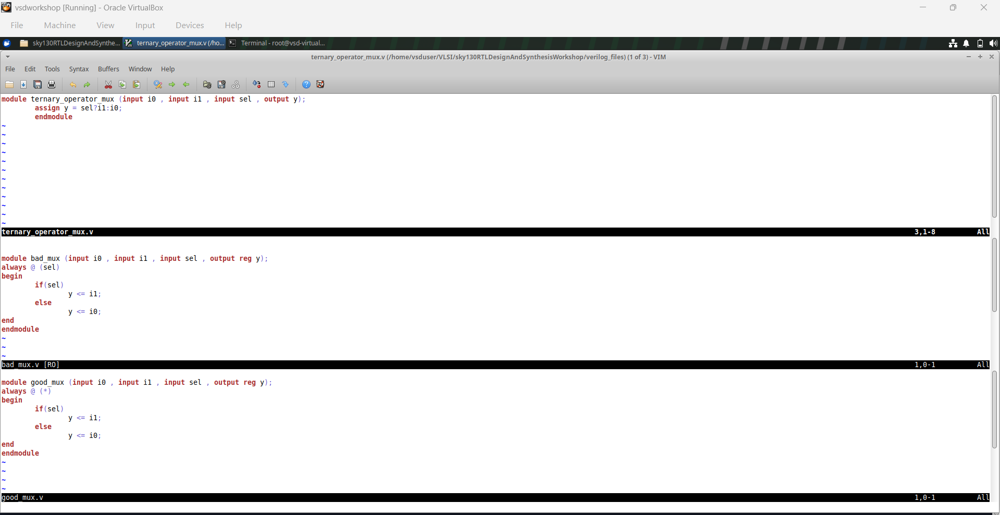
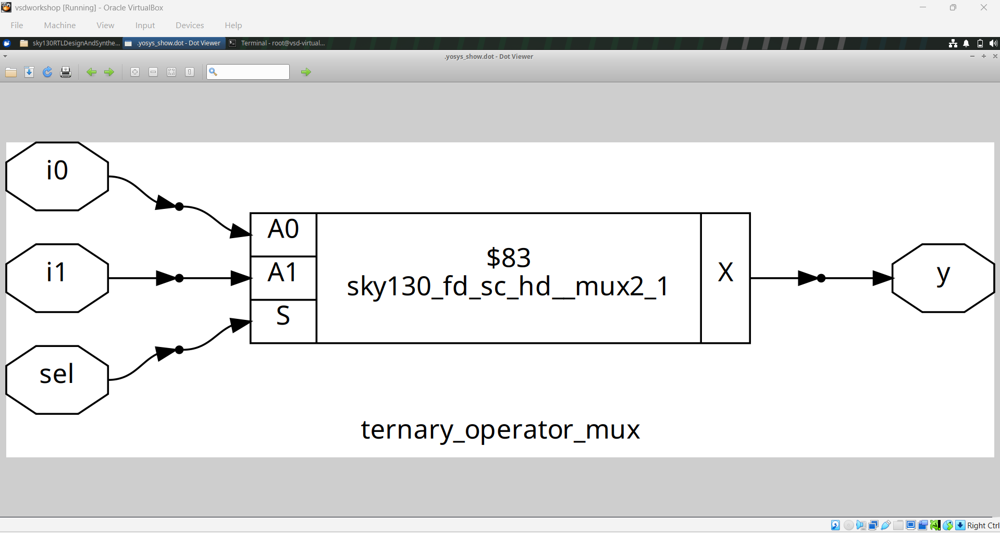
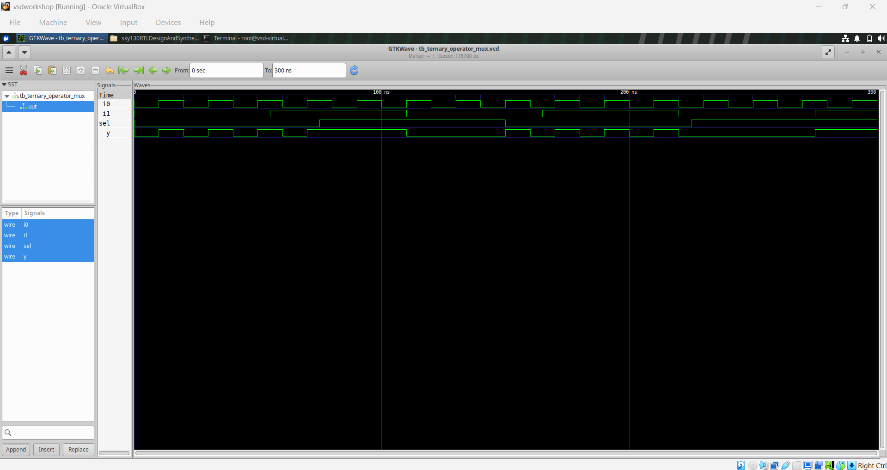
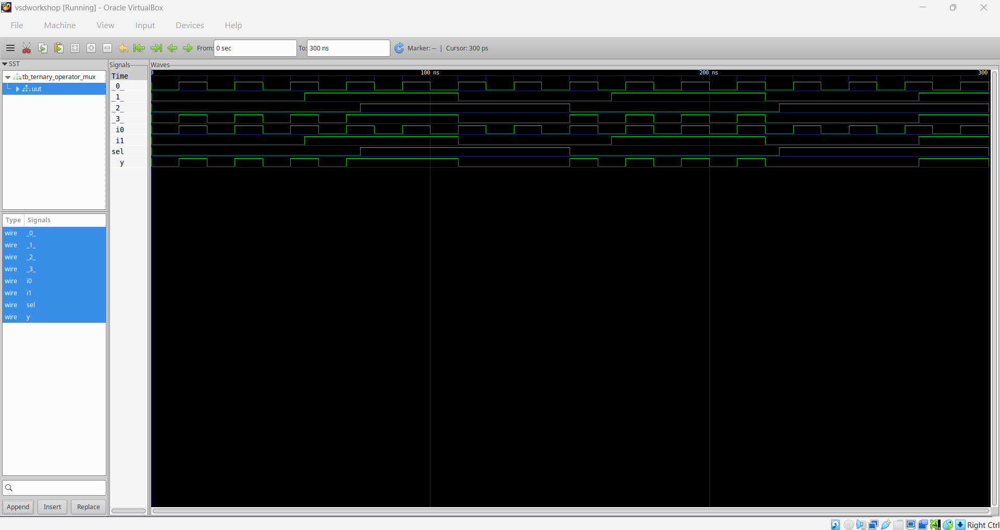
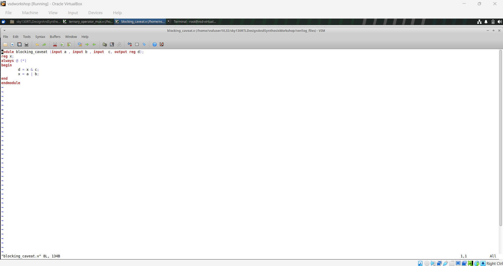

# Module 4 – GLS, Blocking vs. Non-Blocking, and Synthesis-Simulation Mismatch

## Table of Contents

- [Overview](#overview)
- [1. What Is GLS](#1-what-is-gls)
- [2. Synthesis-Simulation Mismatch — Incomplete Sensitivity List](#2-synthesis-simulation-mismatch--incomplete-sensitivity-list)
  - [ternary_operator_mux (reference / correct)](#ternary_operator_mux-reference--correct)
  - [bad_mux](#bad_mux)
  - [good_mux](#good_mux)
- [3. Blocking Assignment Caveat](#3-blocking-assignment-caveat)
- [Key Takeaways](#key-takeaways)

## Overview

This module covers **Gate-Level Simulation (GLS)** and two of the most common ways RTL simulation and the post-synthesis netlist disagree: an **incomplete sensitivity list** in a combinational `always` block, and **blocking (`=`) assignment ordering** inside a combinational block.

## 1. What Is GLS

GLS means simulating the **synthesized netlist** (gates, not RTL) with the same testbench used for RTL simulation. If the design was written correctly, RTL simulation and GLS should produce identical waveforms. If they diverge, it means the RTL had a construct that a human/simulator reads one way but the synthesis tool reads another — i.e. a synthesis-simulation mismatch.

Flow: `iverilog` the synthesized netlist + gate-level primitive models + the same testbench → `gtkwave` the result → compare against the RTL-level waveform.

## 2. Synthesis-Simulation Mismatch — Incomplete Sensitivity List

Three related mux implementations, same interface, to show the difference an `always @(...)` sensitivity list makes:

```verilog
module ternary_operator_mux (input i0 , input i1 , input sel , output y);
	assign y = sel?i1:i0;
endmodule

module bad_mux (input i0 , input i1 , input sel , output reg y);
always @ (sel)
begin
	if(sel)
		y <= i1;
	else
		y <= i0;
end
endmodule

module good_mux (input i0 , input i1 , input sel , output reg y);
always @ (*)
begin
	if(sel)
		y <= i1;
	else
		y <= i0;
end
endmodule
```



### ternary_operator_mux (reference / correct)

A single continuous assignment — there's no sensitivity list to get wrong, so RTL sim and GLS always agree. Used as the ground truth.

| Diagram | Waveform |
|---|---|
|  |  |

**GLS waveform (post-synthesis, same testbench):**  — matches the RTL-level waveform, confirming the synthesized gates behave identically to the RTL.

### bad_mux

`always @ (sel)` only lists `sel` — not `i0`/`i1`. In RTL simulation, `y` only updates when `sel` changes, so a change on `i0` or `i1` while `sel` is steady is **missed**, producing stale/glitchy behavior in simulation. The synthesized hardware has no such restriction — a real mux responds to `i0`/`i1` changes immediately — so GLS will show correct behavior while the RTL simulation showed the bug. That divergence **is** the synthesis-simulation mismatch.

**Waveform (RTL simulation, showing the missed-update behavior):** 

### good_mux

`always @ (*)` auto-infers the full sensitivity list (`sel`, `i0`, `i1`), so it behaves identically to the synthesized hardware in both RTL sim and GLS. This is the fix for `bad_mux`.

## 3. Blocking Assignment Caveat

```verilog
module blocking_caveat (input a , input b , input c, output reg d);
reg x;
always @ (*)
begin
	d = x & c;
	x = a | b;
end
endmodule
```

Inside the `always` block, statements execute **in order** with blocking (`=`) assignment. `d` is computed from `x` *before* `x` is updated to `a | b` — so `d` uses the **previous** value of `x`, not the one being computed this pass. A simulator evaluates this literally, one line at a time. A synthesis tool instead infers the combinational logic each signal actually depends on (`x = a | b`, then `d = x & c`, i.e. effectively `d = (a|b) & c` once settled) — so the synthesized circuit's steady-state behavior doesn't line up with a naive line-by-line reading of the simulation waveform, especially in the first evaluation pass. The reliable fix is to reorder the statements (compute `x` before `d`) so execution order matches the intended data dependency.

| Code | Diagram | Waveform |
|---|---|---|
|  |  |  |

---

## Key Takeaways

- **GLS exists to catch bugs that RTL simulation alone can't** — anything where the simulator's interpretation of the RTL doesn't match what synthesis actually builds.
- `always @ (*)` (or `always_comb`) is not a style preference — an explicit, incomplete sensitivity list (`always @ (sel)` instead of all inputs) is a functional bug that only shows up as an RTL-vs-GLS mismatch.
- Blocking assignment order inside a combinational `always` block matters: writing `d = x & c;` before `x = a | b;` reads back the stale value of `x`. Order statements so each signal is computed before it's used.
