# Module 5 – Optimizations in Synthesis

## Table of Contents

- [Overview](#overview)
- [1. Incomplete `if` — Inferred Latches](#1-incomplete-if--inferred-latches)
  - [incomp_if](#incomp_if)
  - [incomp_if2](#incomp_if2)
- [2. Case Statements — Complete vs. Incomplete vs. Overlapping](#2-case-statements--complete-vs-incomplete-vs-overlapping)
  - [incomp_case](#incomp_case)
  - [comp_case](#comp_case)
  - [bad_case](#bad_case)
- [3. For-Loop / Generate Constructs](#3-for-loop--generate-constructs)
  - [mux_generate](#mux_generate)
  - [demux_case (case-based demux)](#demux_case-case-based-demux)
  - [demux_generate (for-loop demux)](#demux_generate-for-loop-demux)
  - [rca (8-bit Ripple Carry Adder)](#rca-8-bit-ripple-carry-adder)
- [Key Takeaways](#key-takeaways)

## Overview

Where Module 4 covered sensitivity-list and blocking-assignment mismatches, this module covers the other major source of synthesis-simulation mismatch: **incomplete conditional coverage** in `if` and `case` blocks, which causes a synthesis tool to infer an unintended latch. It also covers writing scalable combinational structures (muxes, demuxes, an adder) with `for`/`generate` loops instead of hand-written repetition.

## 1. Incomplete `if` — Inferred Latches

### incomp_if

```verilog
module incomp_if (input i0 , input i1 , input i2 , output reg y);
always @ (*)
begin
	if(i0)
		y <= i1;
end
endmodule
```

No `else` branch. When `i0` is 0, the block doesn't assign `y` at all — synthesis has to infer a **latch** to hold the last value, since combinational logic can't have a "no output specified" state. That latch is almost never the intent, and RTL sim (which does model the latch behavior via "retain last value") will disagree with a reader's expectation of a clean 2:1 mux.

**Testbench code and waveform:** 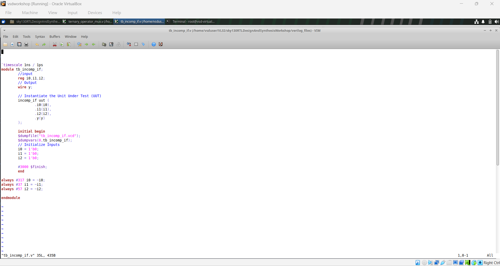 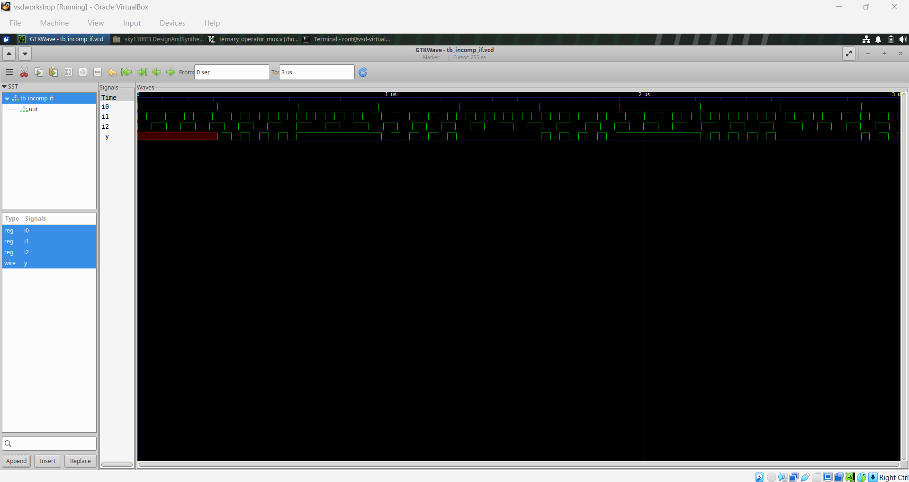

Inferred-latch diagram: 

### incomp_if2

```verilog
module incomp_if2 (input i0 , input i1 , input i2 , input i3, output reg y);
always @ (*)
begin
	if(i0)
		y <= i1;
	else if (i2)
		y <= i3;
end
endmodule
```

Same problem one level deeper: there's an `else if` but still no final `else`, so the case where both `i0` and `i2` are 0 leaves `y` unassigned — still infers a latch.

**Testbench code and waveform:**  

Inferred-latch diagram: 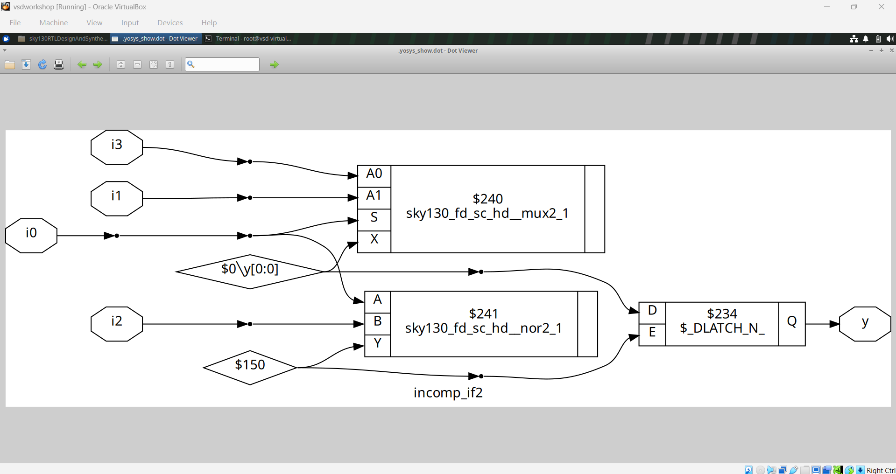

**Source for both:** 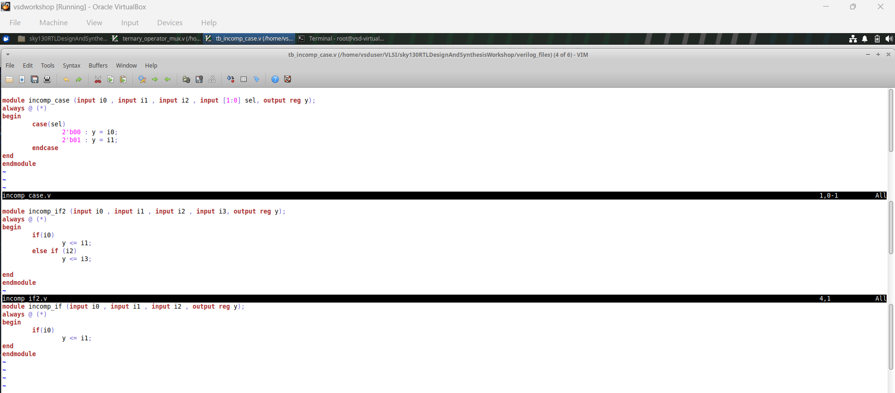

---

## 2. Case Statements — Complete vs. Incomplete vs. Overlapping

### incomp_case

```verilog
module incomp_case (input i0 , input i1 , input i2 , input [1:0] sel, output reg y);
always @ (*)
begin
	case(sel)
		2'b00 : y = i0;
		2'b01 : y = i1;
	endcase
end
endmodule
```

`sel` is 2 bits (4 possible values) but only `2'b00` and `2'b01` are handled — `2'b10` and `2'b11` are left unassigned, so this infers a latch for the same reason as `incomp_if`, just via `case` instead of `if`.

**Testbench code and waveform:**  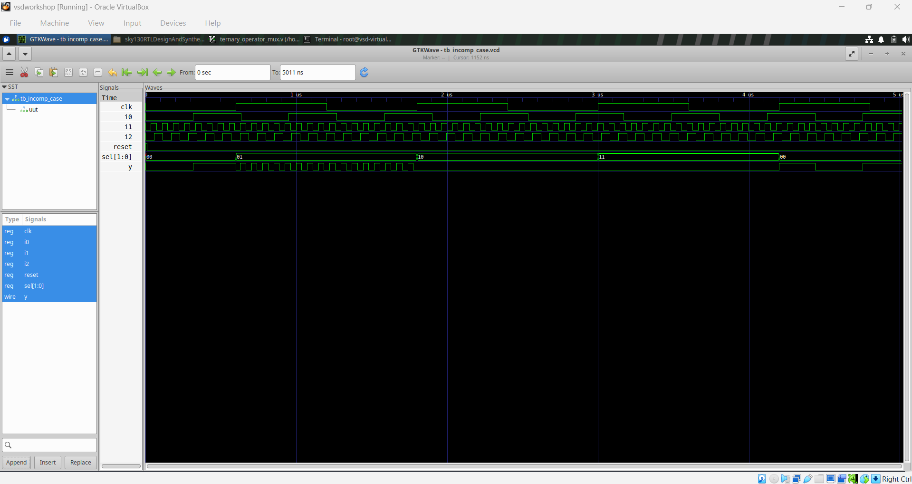

Inferred-latch diagram: 

### comp_case

```verilog
module comp_case (input i0 , input i1 , input i2 , input [1:0] sel, output reg y);
always @ (*)
begin
	case(sel)
		2'b00 : y = i0;
		2'b01 : y = i1;
		default : y = i2;
	endcase
end
endmodule
```

Adding `default` covers every possible value of `sel` — no latch, clean combinational mux.

| Code | Diagram | Testbench Waveform |
|---|---|---|
|  | 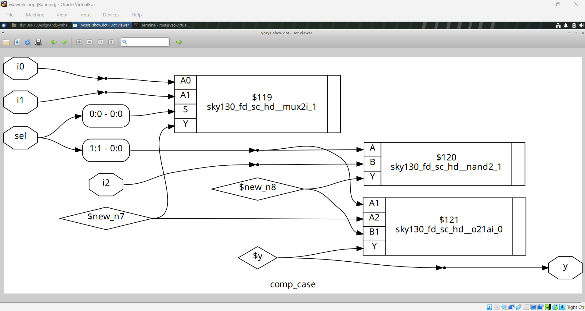 | 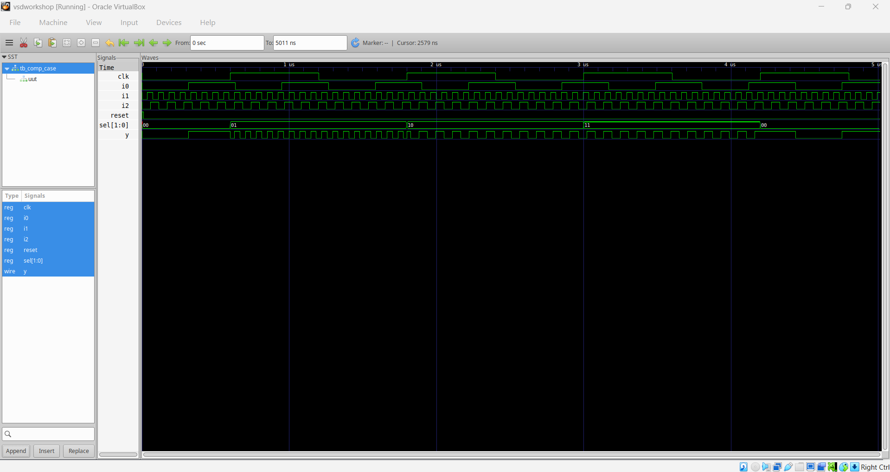 |

### bad_case

```verilog
module bad_case (input i0 , input i1, input i2, input i3 , input [1:0] sel, output reg y);
always @(*)
begin
	case(sel)
		2'b00: y = i0;
		2'b01: y = i1;
		2'b10: y = i2;
		2'b1?: y = i3;
		//2'b11: y = i3;
	endcase
end
endmodule
```

This one *looks* complete (4 branches for 4 values of `sel`) but `2'b1?` is a wildcard pattern that overlaps `2'b10` — and the actual `2'b11` case is commented out. Depending on how the simulator vs. the synthesis tool resolve the overlapping/don't-care pattern, `sel = 2'b11` can behave differently in RTL sim vs. the synthesized netlist. This is a synthesis-simulation mismatch caused by **case-item overlap**, distinct from the missing-branch latch problem above.

| Code | Diagram | Testbench Waveform |
|---|---|---|
|  |  | 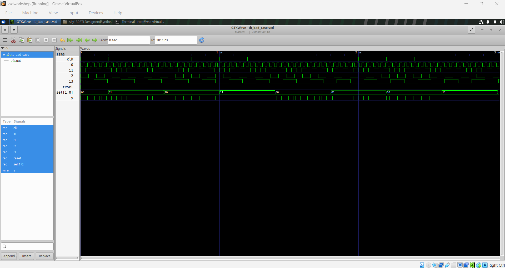 |

---

## 3. For-Loop / Generate Constructs

Using `for`/`generate` to build structurally repetitive hardware instead of writing every bit/instance by hand.

### mux_generate

```verilog
module mux_generate (input i0 , input i1, input i2 , input i3 , input [1:0] sel  , output reg y);
wire [3:0] i_int;
assign i_int = {i3,i2,i1,i0};
integer k;
always @ (*)
begin
	for(k = 0; k < 4; k=k+1) begin
		if(k == sel)
			y = i_int[k];
	end
end
endmodule
```

A 4:1 mux built by looping over the packed input vector and comparing the loop index to `sel`, rather than a hand-written `case` with 4 branches.

| Code | Diagram | Waveform |
|---|---|---|
|  | 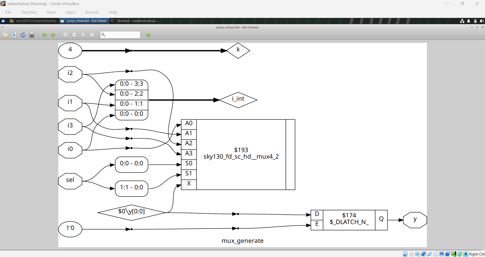 |  |

### demux_case (case-based demux)

```verilog
module demux_case (output o0 , output o1, output o2 , output o3, output o4, output o5, output o6 , output o7 , input [2:0] sel , input i);
reg [7:0] y_int;
assign {o7,o6,o5,o4,o3,o2,o1,o0} = y_int;
integer k;
always @ (*)
begin
	y_int = 8'b0;
	case(sel)
		3'b000 : y_int[0] = i;
		3'b001 : y_int[1] = i;
		3'b010 : y_int[2] = i;
		3'b011 : y_int[3] = i;
		3'b100 : y_int[4] = i;
		3'b101 : y_int[5] = i;
		3'b110 : y_int[6] = i;
		3'b111 : y_int[7] = i;
	endcase
end
endmodule
```

An 8-output demux written the "hand-rolled" way — 8 explicit case branches, one per `sel` value.

| Code | Diagram | Waveform |
|---|---|---|
| 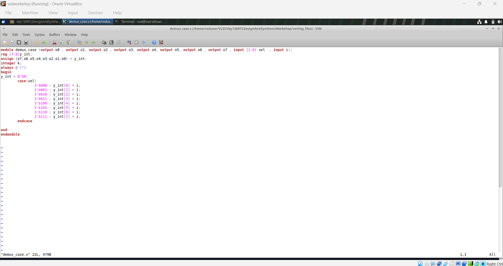 |  | 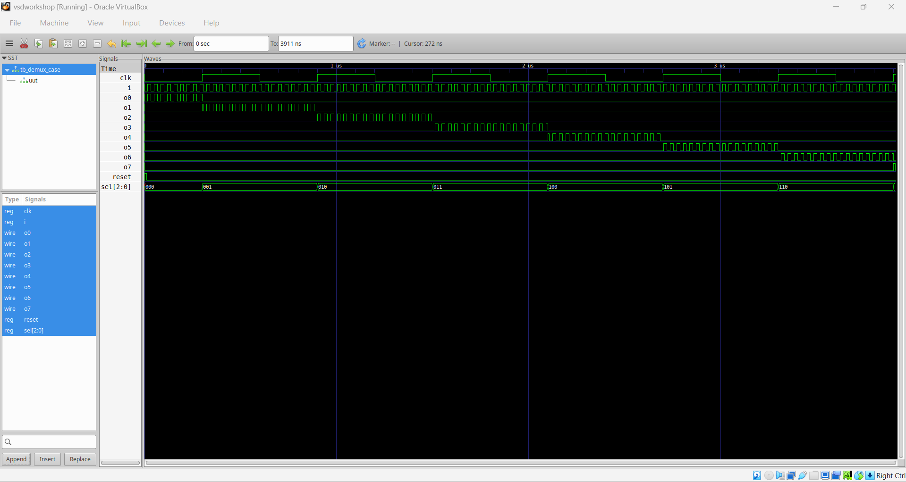 |

### demux_generate (for-loop demux)

```verilog
module demux_generate (output o0 , output o1, output o2 , output o3, output o4, output o5, output o6 , output o7 , input [2:0] sel , input i);
reg [7:0] y_int;
assign {o7,o6,o5,o4,o3,o2,o1,o0} = y_int;
integer k;
always @ (*)
begin
	y_int = 8'b0;
	for(k = 0; k < 8; k++) begin
		if(k == sel)
			y_int[k] = i;
	end
end
endmodule
```

Same 8-output demux as `demux_case`, but the 8 branches are replaced by a single `for` loop — functionally identical, far less repetition, and it scales to a wider `sel` without editing the body.

| Code | Diagram | Waveform |
|---|---|---|
| 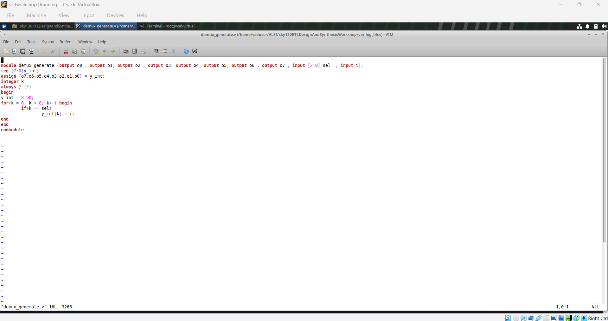 | 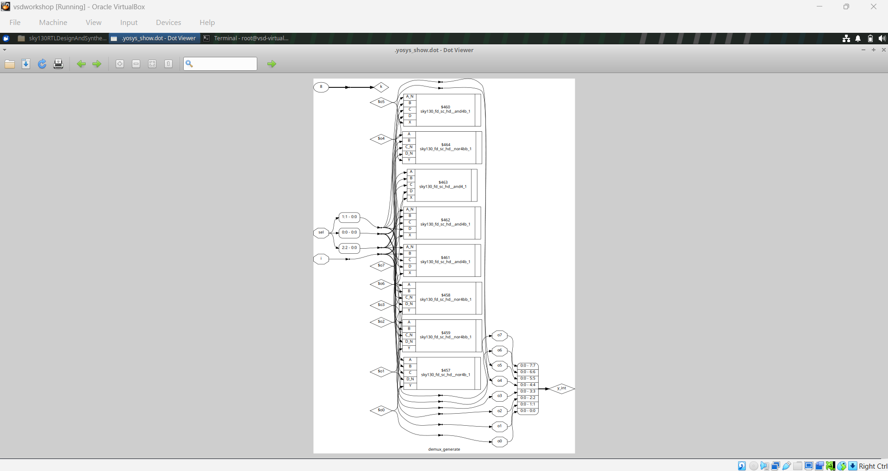 |  |

### rca (8-bit Ripple Carry Adder)

```verilog
module rca (input [7:0] num1 , input [7:0] num2 , output [8:0] sum);
wire [7:0] int_sum;
wire [7:0] int_co;

genvar i;
generate
	for (i = 1 ; i < 8; i=i+1) begin
		fa u_fa_1 (.a(num1[i]),.b(num2[i]),.c(int_co[i-1]),.co(int_co[i]),.sum(int_sum[i]));
	end
endgenerate

fa u_fa_0 (.a(num1[0]),.b(num2[0]),.c(1'b0),.co(int_co[0]),.sum(int_sum[0]));

assign sum[7:0] = int_sum;
assign sum[8]   = int_co[7];
endmodule
```

The bigger structural payoff of `generate`: an 8-bit ripple carry adder built from a single-bit full-adder module (`fa`), instantiated once by hand for bit 0 (no carry-in) and 7 more times via a `generate for` loop for bits 1–7 (chaining each stage's carry-out into the next stage's carry-in). This is the same for-loop idea as `mux_generate`/`demux_generate`, applied to structural instantiation instead of behavioral logic.

| Code | Testbench Waveform |
|---|---|
| 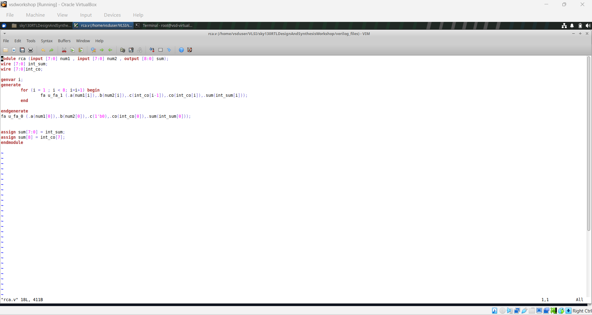 | 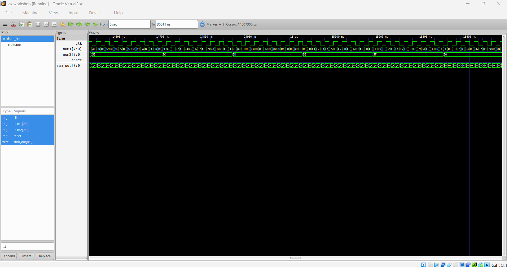 |

---

## Key Takeaways

- Every combinational `if`/`case` needs to cover **every** input combination — a missing `else`, a missing `default`, or a missing case value all infer an unwanted latch, not a "do nothing" no-op.
- Overlapping or wildcard `case` items (`bad_case`'s `2'b1?`) are a separate, sneakier mismatch source from missing coverage — they look complete but resolve differently between simulation and synthesis.
- `for`/`generate` loops aren't just shorter code — `demux_generate` vs. `demux_case` and the `rca` adder show the same hardware coming from parameterizable, scalable RTL instead of manually repeated branches/instances.
