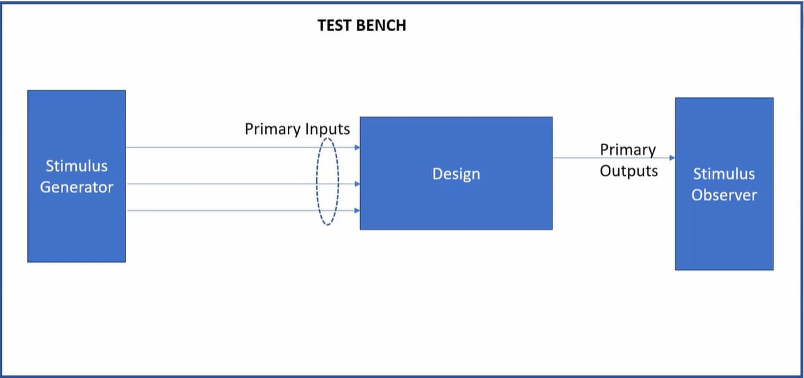
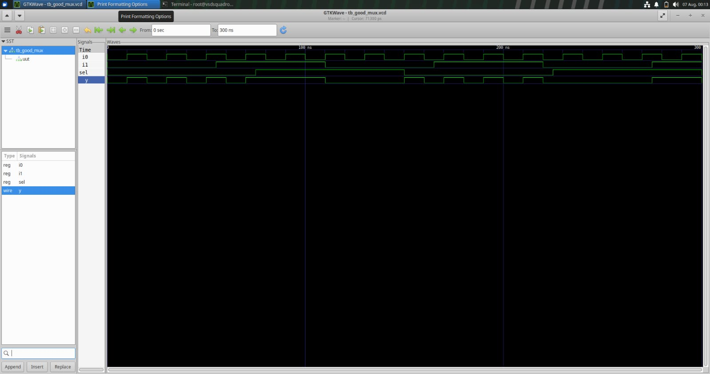

# Module 1 – Introduction to Verilog RTL Design and Synthesis

## Topics Covered

- Simulator, Design, and Testbench — what each term means in an RTL flow
- Icarus Verilog (`iverilog`) simulation flow
- Writing and simulating a 2:1 multiplexer (`good_mux`)
- Waveform analysis in GTKWave

## Simulator, Design, Testbench

A design is only verified against a self-checking or stimulus-driven testbench: a **stimulus generator** drives primary inputs into the **design**, and a **stimulus observer** checks the primary outputs.



## Iverilog-Based Simulation Flow

Both the design (`good_mux.v`) and testbench (`tb_good_mux.v`) are passed into `iverilog`, which produces a simulation executable. Running it dumps a `.vcd` (Value Change Dump) file, which GTKWave reads to render waveforms.


```bash
iverilog good_mux.v tb_good_mux.v
./a.out
gtkwave tb_good_mux.vcd
```

## Design: 2:1 Multiplexer

[`src/good_mux.v`](./src/good_mux.v)

```verilog
module good_mux (input i0 , input i1 , input sel , output reg y);
always @ (*)
begin
	if(sel)
		y <= i1;
	else
		y <= i0;
end
endmodule
```


Testbench: [`src/tb_good_mux.v`](./src/tb_good_mux.v) — **replace the placeholder in this file with your actual testbench code before relying on this repo**; it wasn't captured in the screenshot.

## Simulation Result

`y` tracks `i1` when `sel` is high and `i0` when `sel` is low, confirming correct mux behavior across the simulated window.



## Key Takeaway

`iverilog` + a testbench gives you a purely functional (pre-synthesis) check of RTL behavior — no timing, no gates, just logic correctness against the waveform.
