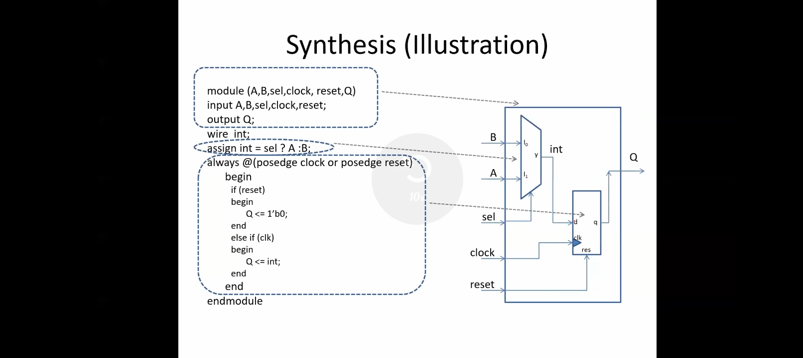
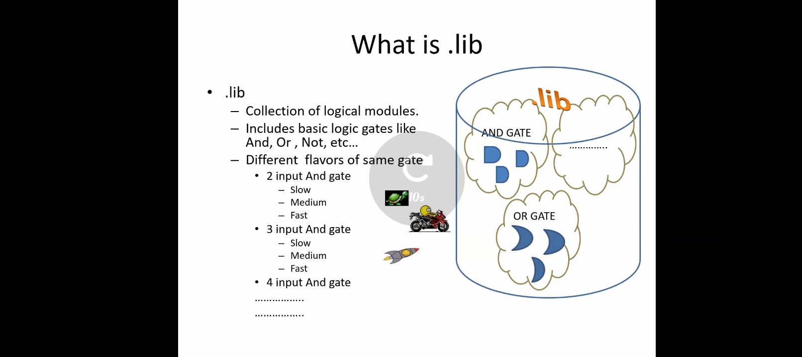
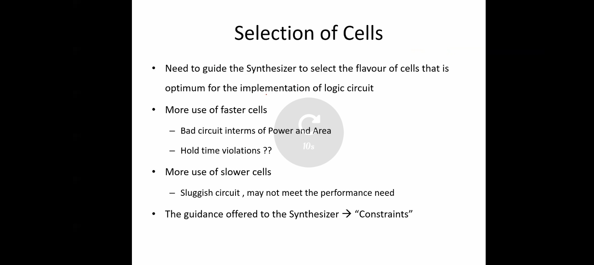
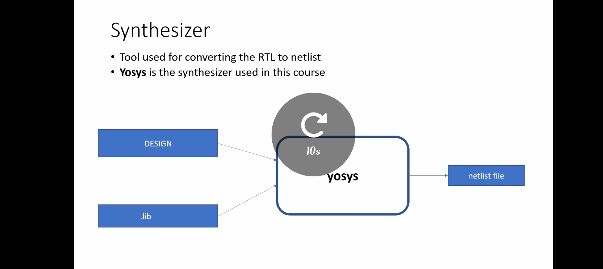
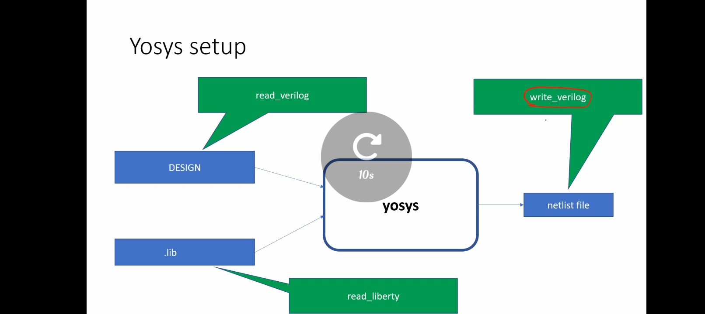

# Module 2 – Timing Libs, Hierarchical vs Flat Synthesis, Efficient Flop Coding Styles

## Topics Covered

- What synthesis actually does: RTL → gate-level netlist
- What a `.lib` (timing library) contains and why multiple cell flavors exist
- How cell selection trades off speed, power, area, and hold time
- The Yosys synthesis flow and command set

## Synthesis: RTL to Gates

Synthesis maps a behavioral Verilog description onto real logic cells — muxes, flip-flops, gates — pulled from a technology library. The `if/else`-driven mux logic becomes a physical 2:1 mux cell, and the clocked always block becomes a flip-flop with reset.



## What Is `.lib`

A `.lib` file is a **collection of logical modules** — the cells a synthesizer is allowed to use. It's not one AND gate, one OR gate, etc.; it's every usable flavor of each: a 2-input AND in slow/medium/fast variants, a 3-input AND in slow/medium/fast, and so on. This is what lets the synthesizer trade speed for power/area on a per-instance basis.



## Cell Selection Is a Trade-off, Not a Free Choice

- **More fast cells** → bad power/area, and risk of **hold time violations**.
- **More slow cells** → sluggish circuit that may miss performance targets.
- The synthesizer needs to be told which to prefer — that guidance is a **constraint**.



## Synthesizer: Yosys

Yosys takes the design (RTL) and the `.lib` and produces a gate-level netlist.



### Yosys Command Flow

```tcl
read_verilog design.v
read_liberty -lib your_standard_cells.lib
synth -top <top_module>
write_verilog synth_netlist.v
```



## Key Takeaway

Timing libraries aren't a single gate per function — they're a menu of speed/power/area trade-offs, and synthesis constraints are how you tell Yosys which end of that menu to pick from. Get this wrong and you either bloat area/power or introduce hold violations.

## Not Yet Documented

The module title covers **hierarchical vs. flat synthesis** and **efficient flop coding styles**, but none of the provided screenshots touch either topic — this README only reflects the `.lib`/cell-selection/Yosys-flow content that was actually captured. Add sections (and screenshots or netlist snippets) for those two before calling this module complete.

