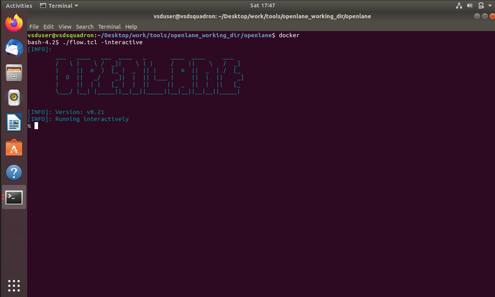
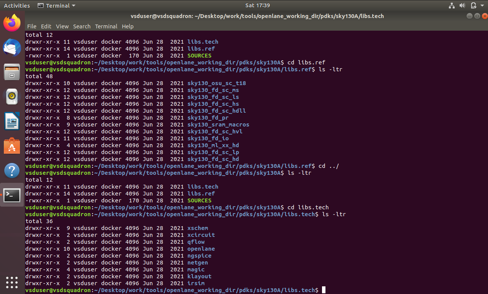
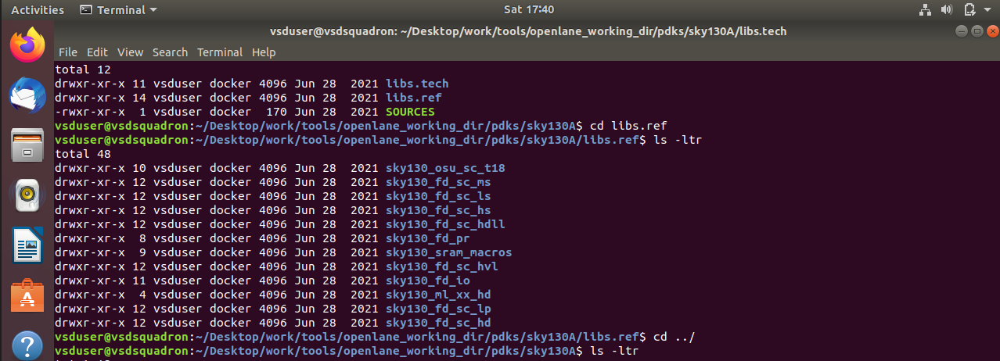
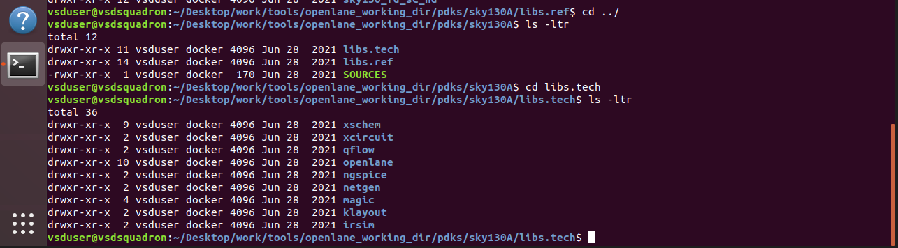
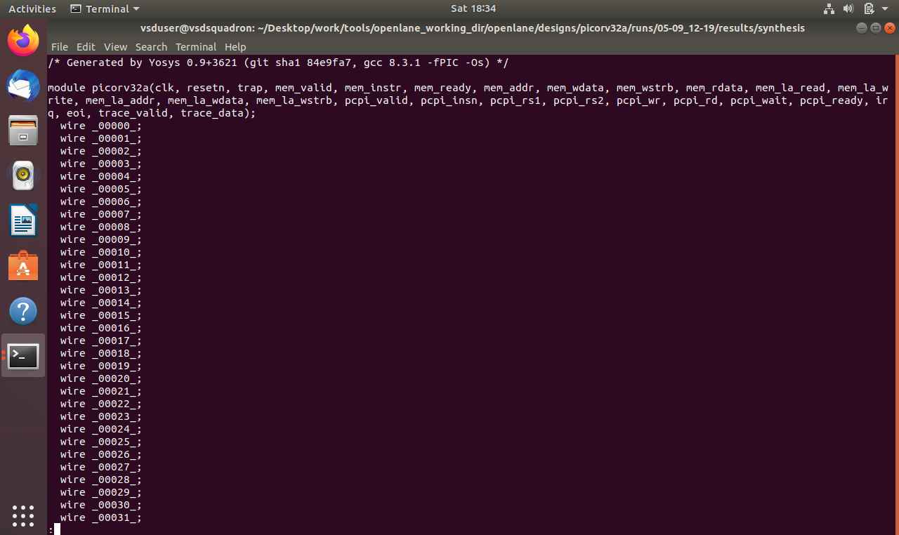
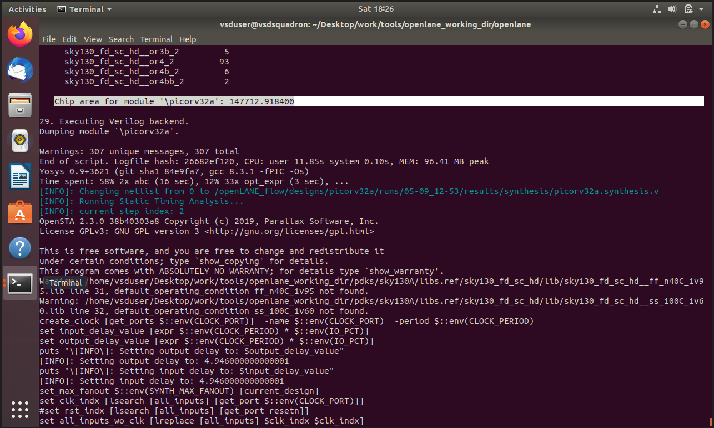

# Module 1 — Inception of Open-Source EDA, OpenLane and Sky130 PDK

## Overview

This module introduces the foundations of open-source Electronic Design Automation (EDA), the OpenLane RTL-to-GDSII flow, and the Sky130 Process Design Kit (PDK).

The practical work includes exploring the OpenLane environment, understanding the tools involved in the flow, examining technology-specific information, and observing synthesis/netlist generation.

## Topics Covered

### 1. How to Talk to Computers

Understanding how a high-level hardware description is transformed into lower-level representations that can ultimately be implemented as digital hardware.

### 2. SoC Design and OpenLane

Introduction to:

- System-on-Chip (SoC) design
- RTL design
- Synthesis
- Physical design
- OpenLane's role in the RTL-to-GDSII flow

### 3. Getting Familiar with Open-Source EDA Tools

Practical exploration of the tools and files used by OpenLane.

### 4. Technology-Specific and Tool-Specific Concepts

Understanding the distinction between:

- **Technology-specific information** — related to the target fabrication technology/PDK.
- **Tool-specific information** — related to the EDA tools used during implementation.

### 5. Synthesis and Netlist

The synthesis stage converts RTL into a gate-level representation using cells from the target standard-cell library.

The practical screenshot shows the generated synthesis/netlist information.

### 6. Basic Timing-Related Calculations

The module also includes practical calculations involving clock-related values, ratios and percentages.

## Practical Screenshots

### OpenLane

### Overall Technology and Tools

### Technology-Specific Information

### Tool-Specific Information

### Synthesis Netlist

### Chip Area

### Clock Ratio and Percentage

## Key Takeaways

- Open-source EDA tools can be used to implement digital IC designs.
- OpenLane provides an automated RTL-to-GDSII implementation flow.
- The PDK supplies technology-dependent information required by the implementation tools.
- Synthesis produces a gate-level netlist suitable for subsequent physical-design stages.
- Tool configuration and technology configuration serve different purposes in an EDA flow.
