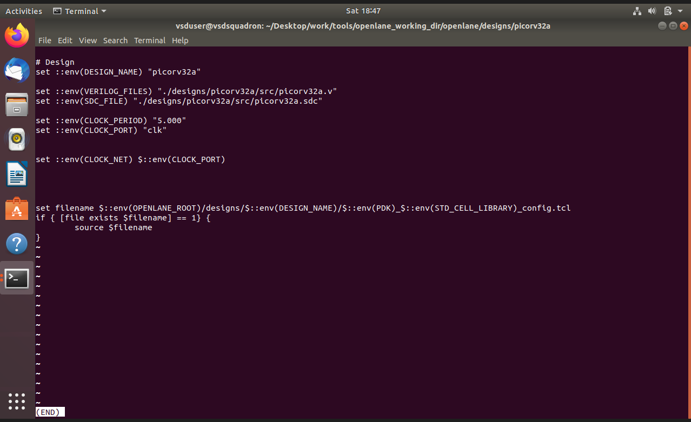
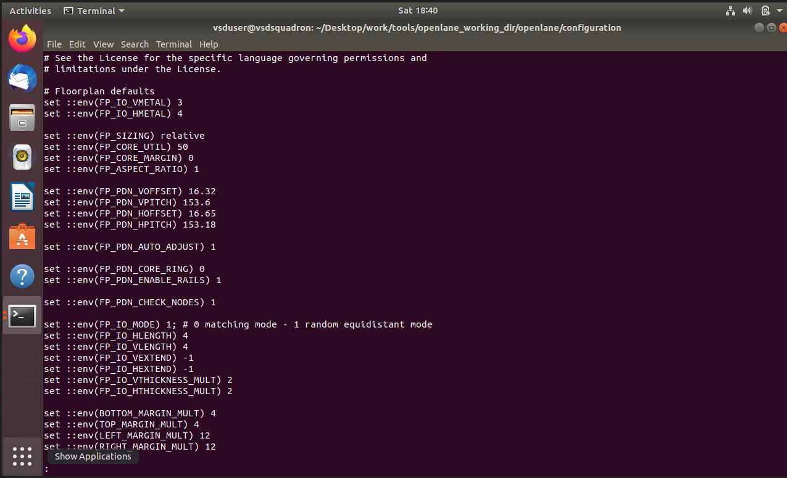
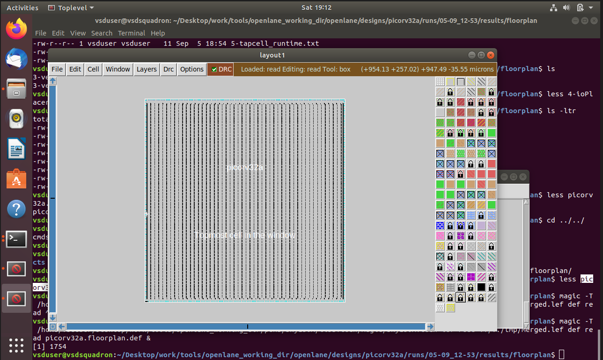
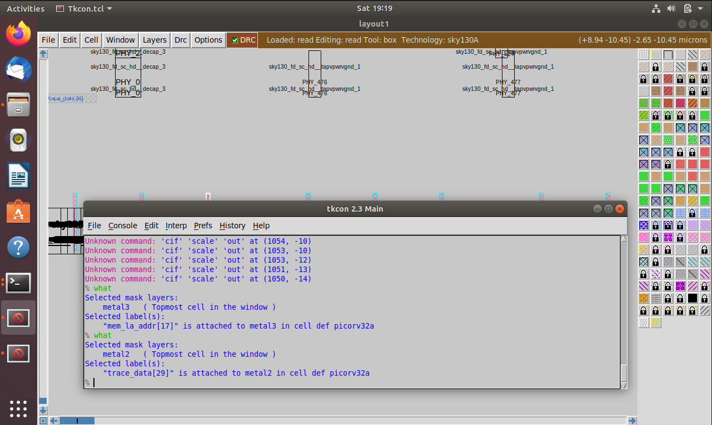
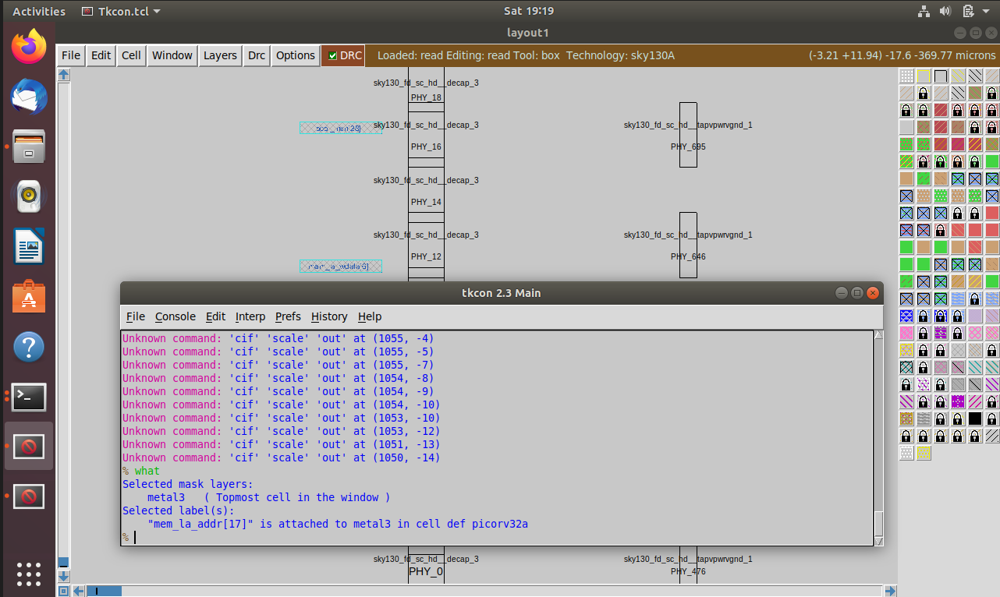
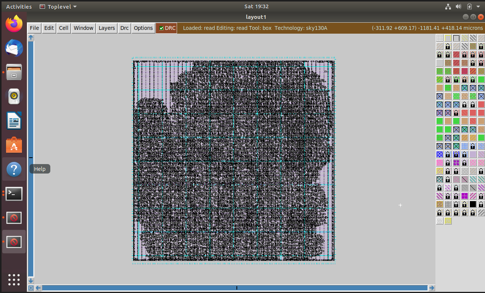

# Module 2 — Floorplanning and Introduction to Library Cells

## Overview

This module introduces physical-design floorplanning and the relationship between floorplan parameters and chip implementation quality.

The practical work covers floorplan considerations, utilization factor, aspect ratio, cell design and characterization, timing characterization parameters, metal layers, and standard-cell placement.

## Topics Covered

### 1. Chip Floorplanning Considerations

Floorplanning determines the basic physical organization of a chip, including the placement and available area for major design components.

Important considerations include:

- Die/core dimensions
- Placement area
- Utilization
- Aspect ratio
- I/O and routing requirements
- Available space for standard cells

### 2. Utilization Factor and Aspect Ratio

**Utilization factor** describes how much of the available core area is occupied by placed cells.

A commonly used relationship is:

```text
Utilization = (Area occupied by cells / Available core area) × 100
```

**Aspect ratio** describes the relationship between the height and width of the floorplan:

```text
Aspect Ratio = Height / Width
```

These parameters influence routing resources, congestion, and the overall physical implementation.

### 3. Cell Design and Characterization Flow

Standard cells are designed and characterized so that their physical and timing behavior can be used by digital implementation tools.

Characterization provides information such as:

- Delay
- Transition time
- Power-related behavior
- Input/output timing relationships

### 4. General Timing Characterization Parameters

Timing characterization involves parameters that describe how a cell behaves for different input transitions, output loads, and operating conditions.

Important concepts include:

- Cell delay
- Slew / transition
- Input capacitance
- Output load
- Setup and hold behavior

### 5. Floorplan Visualization

The practical work includes viewing the generated floorplan using Magic.

### 6. Metal Layers

The practical screenshots demonstrate different metal layers, including Metal 2 and Metal 3, used for interconnection in the physical layout.

### 7. Standard-Cell Placement

The final practical visualization shows the placement of standard cells within the floorplan.

## Practical Screenshots

### Design Name / Configuration



### Floorplan



### Magic Floorplan Layout



### Metal 2



### Metal 3



### Standard-Cell Placement



## Key Takeaways

- Floorplanning is an important early stage of physical design.
- Utilization and aspect ratio directly affect the available physical-design space.
- Standard cells must be physically and electrically characterized before being used effectively in implementation.
- Metal layers provide routing resources for connecting cells.
- Placement determines the physical locations of standard cells before later routing stages.
- Magic can be used to inspect and visualize physical layout results.
